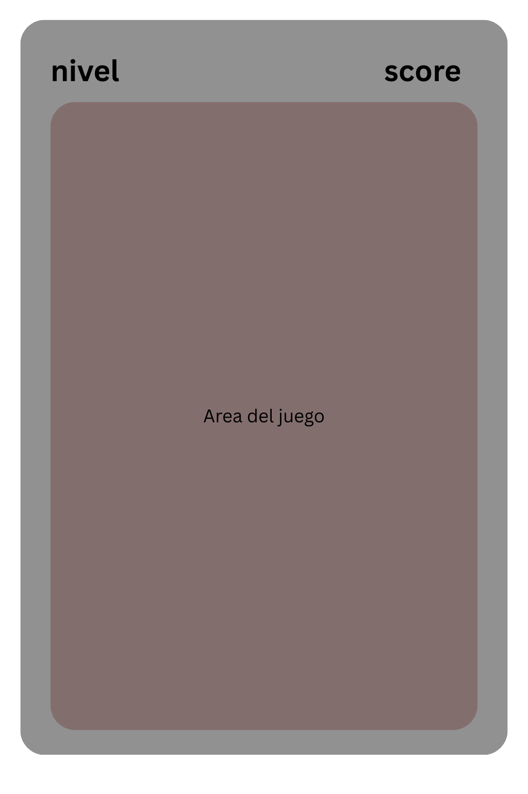

# Estética y Estilo Visual: Jade Tecnológico

Esta guía define la identidad visual y narrativa de **Dana**, centrada en la fusión entre la magnificencia de la China Imperial y la precisión de la tecnología moderna.

## 1. Visión Estética
El concepto central es el **"Jade Tecnológico"**. Evoca una atmósfera ritualista y solemne, donde la herencia cultural se manifiesta a través de interfaces digitales vibrantes. Es el contraste entre la profundidad de la tinta china y el brillo del neón.

## 2. Paleta de Colores Primaria

| Concepto | Color | Hex Code | Uso Principal |
| :--- | :--- | :--- | :--- |
| **Negro Lacado** | Tinta China | `#0D0D0D` | Fondos de pantalla y superficies profundas. |
| **Oro Imperial** | Estructura | `#D4AF37` | Marcos, bordes de importancia y jerarquía. |
| **Verde Jade** | Energía | `#00FF9D` | Interactividad, estados activos y vitalidad. |
| **Rojo Bermellón** | Alerta | `#E63946` | Errores, avisos críticos y tradición. |

---

## 3. Guía de Simbología (Memorización)

Los símbolos utilizados en juegos como **WorkingMemory** se dividen en categorías cósmicas y elementales, cada uno con una paleta de tres colores para representaciones en gradiente.

### A. Los Trigramas (Ba Gua)
Inspirados en los *Exámenes Imperiales (Keju)* y la cosmología taoísta.

*   **☰ Cielo**: `#1968c9`, `#ff5324`, `#ffffff`
*   **☷ Tierra**: `#452710`, `#309e0c`, `#f1ab1f`
*   **☲ Fuego**: `#314aed`, `#f3d52a`, `#dd3c2d`
*   **☵ Agua**: `#86bbff`, `#95f8ff`, `#b6b3ff`
*   **☱ Aire**: `#314aed`, `#d561ff`, `#384697`

### B. Los Cinco Elementos (Wu Xing)
Representan el ciclo de la vida y la transformación.

*   **木 Madera (Mù)**: `#2d5a27`, `#a0c11b`, `#5c4033`
*   **火 Fuego (Huǒ)**: `#ff4500`, `#d73333`, `#ffd700`
*   **土 Tierra (Tǔ)**: `#8b4513`, `#daa520`, `#c2b280`
*   **金 Metal (Jīn)**: `#e5e4e2`, `#c0c0c0`, `#71797e`
*   **氵 Agua (Shān)**: `#002366`, `#007ba7`, `#000000`

---

## 4. Principios de UI y Layout

### Estructura y Marcos (Frames)
La interfaz utiliza el concepto de **Celosías (Lattice Work)**. En lugar de bordes redondeados modernos, se prefieren los ángulos rectos o patrones geométricos asiáticos que imiten la arquitectura de madera tallada.

### Jerarquía Visual
*   **Tablero Ritual**: El área de juego es prioritaria y debe ocupar el centro de la atención.
*   **Información Compacta**: El nivel y la puntuación se presentan de forma minimalista en contenedores que evocan sellos imperiales.

### Tipografía
*   **Títulos/Rituales**: Fuentes *Serif* para evocar tradición y caligrafía.
*   **Datos/Técnico**: Fuentes *Monospace* o *Sans-serif* para números y comunicación de sistema.

---

## 5. Layout de Referencia

